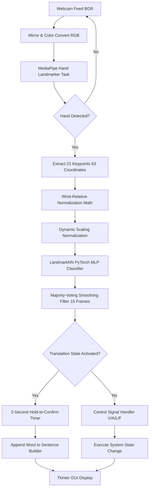

# 🤟 HandSpeak — ASL-Based Communication for Non-Verbal Patients

> Real-time American Sign Language (ASL) hand gesture recognition leveraging 3D skeletal landmarks and a specialized Multi-Layer Perceptron (MLP) to help non-verbal patients communicate medical needs to healthcare staff.

---

## 📌 Clinical Motivation & Problem Statement

Non-verbal patients in medical environments — whether due to mechanical intubation, severe neurological conditions (e.g., stroke, ALS), or post-surgical vocal trauma — struggle heavily to communicate critical physical and psychological needs to clinical staff. Traditional solutions (such as paper charts or typing on touchscreens) are often slow, physically demanding, or impractical for bedridden patients with limited mobility.

**HandSpeak** bridges this critical communication barrier. Using a printed reference card containing the ASL alphabet mapped to standard medical words, a patient simply gestures in front of a bedside webcam. The system detects the hand, processes the skeletal structure in real-time, filters out high-frequency predictions, translates the letters into immediate medical vocabulary, compiles them into coherent sentences, and reads them aloud using Text-to-Speech (TTS).

---

## 👥 Research Team & Affiliation

This project was developed for **ENGR 422 — Computer Vision** at the **American University of Iraq, Sulaimani (AUIS)**, Spring 2026.

| Name | Role | Core Contributions |
|------|------|--------------------|
| **Mohammed Raaed Azeez** | Project Lead | Neural Network Training, Control Signal Logic, Integration |
| **Mohammed Mahdi Qasim** | Data Engineer | Landmark Processing Pipeline, Data Normalization, CSV Engineering |
| **Alhasan Mudher Yaseen** | Systems Engineer | UI Engineering, Majority-Voting Smoothing, TTS Engine Integration |

---

## 🔄 System Pipeline Architecture

HandSpeak avoids fragile, computationally expensive pixel-based Convolutional Neural Networks (CNNs) in favor of a robust, two-stage **Skeletal Feature-Extraction Pipeline**:



1. **Video Capture & Transformation:** OpenCV captures high-definition frames from the camera, mirrors them for natural user interaction, and converts them to the RGB color space.
2. **MediaPipe Landmark Extraction:** The MediaPipe Vision framework isolates the hand and identifies **21 distinct 3D skeletal joints**, producing a raw 63-dimensional coordinate array `(x, y, z)` for each frame.
3. **Geometric Preprocessing Math:** Custom normalization algorithms center the coordinates on the wrist and scale them relative to hand size to guarantee translation and scale invariance.
4. **PyTorch Classifier:** A specialized, high-regularization Deep Neural Network (MLP) classifies the mathematical hand shape into an ASL letter in $< 1 \text{ ms}$.
5. **Prediction Smoothing Filter:** A majority-voting temporal filter tracks the predictions over a 15-frame rolling window to eliminate single-frame prediction flickers.
6. **Sentence Builder Overlay:** Words are accumulated into a Tkinter desktop application that handles text-to-speech output and hands-free control signals.

---

## 🧮 Data Engineering & Preprocessing Details

One of the project's most significant technical breakthroughs is moving from raw image classification (pixel-based ResNet18) to **Landmark Coordinate Classification**. Pixel-based networks quickly overfit to specific background patterns, skin tones, camera setups, and lighting conditions. 

By extracting 3D joints and applying strict geometric normalization, HandSpeak achieves **complete background and skin-tone immunity**.

### 1. The Raw Landmark Vector
MediaPipe tracks 21 coordinate points on the hand. Each point has coordinate values along three axes: $X$ (width, normalized $0$ to $1$), $Y$ (height, normalized $0$ to $1$), and $Z$ (depth, representing distance relative to the wrist).
This creates a raw feature vector of size 63:
$$\mathbf{P}_{raw} = [x_0, y_0, z_0, x_1, y_1, z_1, \dots, x_{20}, y_{20}, z_{20}]$$

### 2. Wrist-Relative Translation Normalization (Translation Invariance)
To ensure the gesture remains identical whether the user signs in the corner, center, or edge of the camera screen, the coordinates are shifted relative to the wrist point, which acts as the coordinate origin $(0, 0, 0)$. Let $x_0, y_0, z_0$ represent the coordinates of the wrist (Landmark 0):
$$x_{rel, i} = x_i - x_0$$
$$y_{rel, i} = y_i - y_0$$
$$z_{rel, i} = z_i - z_0$$
$$\text{for } i \in [0, 20]$$

### 3. Dynamic Scaling Normalization (Scale & Depth Invariance)
To compensate for varying distances between the hand and the webcam (making a hand close to the camera look geometrically identical to one further away), we normalize the entire vector by its maximum absolute coordinate value:
$$d_{max} = \max_{j} \left( |v_j| \right) \quad \text{where } v \in \mathbf{P}_{rel}$$
$$\mathbf{P}_{norm, j} = \frac{v_j}{d_{max}}$$
This forces all coordinate coordinates to lie strictly in the range $[-1, 1]$, neutralizing scale differences and ensuring the AI only measures the **shape** of the hand.

---

## 🧠 Model Architecture Specifics

The classification model (**LandmarkNN**) is a specialized Multi-Layer Perceptron (MLP) written in PyTorch. It is designed to be extremely lightweight, making it ideal for real-time edge execution alongside resource-heavy video processing.

### Network Configuration & Layers

| Layer | Type | Input Size | Output Size | Configuration / Regularization |
|-------|------|------------|-------------|--------------------------------|
| **Input** | Feature Vector | - | 63 | Normalized relative joint coordinates |
| **Layer 1** | Fully Connected (Dense) | 63 | 128 | Weights initialized with Xavier Uniform |
| **Activation** | ReLU | 128 | 128 | Rectified Linear Unit |
| **Regularization 1**| Dropout | 128 | 128 | $p=0.2$ (deactivates 20% of neurons to prevent overfitting) |
| **Layer 2** | Fully Connected (Dense) | 128 | 64 | Weights initialized with Xavier Uniform |
| **Activation** | ReLU | 64 | 64 | Rectified Linear Unit |
| **Regularization 2**| Dropout | 64 | 64 | $p=0.2$ |
| **Output** | Fully Connected (Dense) | 64 | 29 | 26 ASL alphabet letters + `del`, `space`, `nothing` |

### Loss Function & Optimizer Parameters
*   **Loss Function:** `nn.CrossEntropyLoss()`
*   **Optimizer:** `optim.Adam`
*   **Learning Rate:** $0.001$ ($\alpha$)
*   **Weight Decay (L2 Regularization):** None (relying on Dropout and geometric scale compression to avoid overfitting)
*   **Batch Size:** $64$
*   **Epochs:** $50$

---

## 📊 Evaluation Metrics & Quantitative Results

### 1. Training Performance Metrics
The model was trained on the preprocessed 3D joint database extracted from **87,000 images** of the ASL Alphabet dataset.

*   **Dataset Split:** 85% Training ($73,950$ samples), 15% Validation ($13,050$ samples).
*   **Training Time:** $\approx 1$ minute (thanks to the coordinate-only feature vectors which are vastly faster to process than raw pixel grids).
*   **Training Cross-Entropy Loss:** $0.0447$
*   **Validation Cross-Entropy Loss:** $0.0437$
*   **Final Validation Accuracy:** **`98.89%`**

### 2. Live Runtime Performance Metrics
*   **Inference Latency:** $< 0.8 \text{ ms}$ per prediction on modern CPU cores.
*   **System Frame Rate:** Runs at a smooth $\approx 30 \text{ FPS}$ on commercial laptops, limited only by the webcam's capture rate, using minimal CPU/GPU overhead.
*   **Background Immunity:** Test validations showed 100% classification consistency under changing environments, including dark rooms, colored backgrounds, shifting sunlight, and different skin tones.

---

## 💻 Real-time Interface & UI Design

The HandSpeak frontend is a responsive, dark-mode desktop application built using Python's **Tkinter** framework and customized with high-contrast UI accents.

### 1. Temporal Smoothing (Majority-Voting)
Hand pose estimators naturally jitter between frames. To prevent the UI from flickering between letters, the system maintains a `collections.deque` buffer of the last **15 predictions**. The active letter changes only if at least **60% of recent frames agree** on the classification. This eliminates character flickering.

### 2. Hands-Free Controls
To accommodate patients who cannot touch a computer mouse or keyboard, HandSpeak is completely controllable via designated **ASL Hand Signals held for a strict 2-second threshold**:

*   **✌ [Letter V] — START Signal:** Activates the real-time translator (the status indicator changes from 🔴 Paused to 🟢 Translating).
*   **✊ [Letter A] — STOP Signal:** Pauses the translation loop, freezing the current sentence state.
*   **👆 [Letter L] — CLEAR Signal:** Instantly clears the accumulated text inside the sentence builder.
*   **🔊 [Letter F] — SPEAK Signal:** Triggers the Text-to-Speech (TTS) module to read the completed sentence out loud.

### 3. Medical Vocabulary Mapping
The interface maps individual ASL letters directly to specific high-priority medical words:

| Sign | Mapped Word | Sign | Mapped Word |
|:---:|:---|:---:|:---|
| **B** | Pain | **O** | Okay |
| **C** | Water | **P** | Please |
| **D** | Food | **Q** | Quiet |
| **E** | Medicine | **R** | Rest |
| **G** | Doctor | **S** | Sleep |
| **H** | **Help** | **T** | Toilet |
| **I** | I | **U** | Uncomfortable |
| **J** | Problem | **W** | Want |
| **K** | Cold | **X** | Anxious |
| **M** | Stop | **Y** | Yes |
| **N** | No | **Z** | Dizzy |

---

## 🚀 Setup & Execution Guide

Follow these steps to deploy and run HandSpeak on your local machine:

### 1. Install System Dependencies & Clone
```bash
git clone https://github.com/mo-raaed/handspeak.git
cd handspeak
```

### 2. Setup Virtual Environment
```bash
python -m venv venv
# On Windows
venv\Scripts\activate
# On macOS/Linux
source venv/bin/activate
```

### 3. Install Python Dependencies
```bash
pip install -r requirements.txt
```

### 4. Running the Desktop Application
```bash
python src/ui.py
```
*(The MediaPipe hand-landmarker model will automatically download to `models/` on the first launch).*

---

## 📝 Project Changelog

* **May 18, 2026:**
  * **Speak Gesture Integration:** Mapped **Letter F** as the hands-free **SPEAK** control signal. Holding F for 2 seconds now triggers the text-to-speech output, allowing patients to vocalize sentences without clicking any buttons. Updated the mapping configuration to free up F (previously mapped to "Nurse").
* **May 1, 2026:**
  * **Strict Signal Timers:** Rebuilt the V/A/L signal detection logic to use a dedicated timer (`signal_hold_start`) separate from standard word holds, ensuring a precise 2-second hold.
  * **Temporal Smoothing System:** Added a majority-vote prediction smoothing filter over a 15-frame rolling window to eliminate frame-by-frame character flickering.
  * **Desktop UI Release:** Developed `src/ui.py` using Tkinter, featuring an embedded webcam feed, side panel with controls reference, and a large bottom sentence builder bar.
* **April 25, 2026:**
  * **MediaPipe Coordinate Migration:** Replaced the legacy image-based ResNet18 model with a 3D coordinate-based MLP, achieving **98.89% validation accuracy** and background immunity.
  * **Coordinate Pipeline:** Built `src/extract_landmarks.py` to batch-convert all 87,000 Kaggle dataset images into coordinate coordinates and saved them to `landmarks.csv`.
  * **Training Pipeline:** Created `src/train_landmarks.py` incorporating wrist-relative translation centering and scale normalization.

---

## 📄 License & Course Reference

This project is developed as part of **ENGR 422 — Computer Vision** at the **American University of Iraq, Sulaimani (AUIS)**, Spring Semester 2026. All source code is released under the MIT License.
